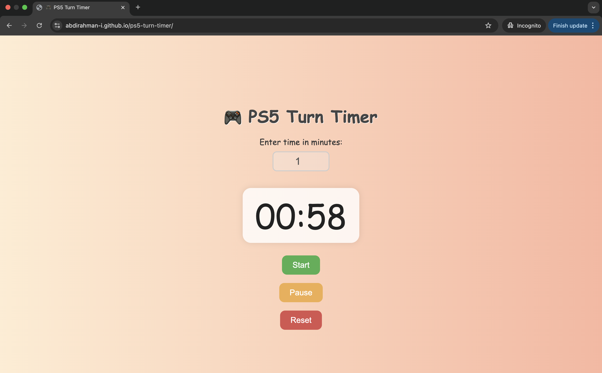

# 🎮 PS5 Turn Timer

This project started as a simple Bash script I wrote while looking after my nieces as they took turns playing on the PS5. I was manually tracking their 6-minute playtimes and thought — why not automate it?

I then turned the idea into a web app to make it easier and more fun for them (and me 😄).

---

## 🔧 Features

### 🖥️ Web App Version (HTML/CSS/JS)
- 6-minute countdown timer
- Plays a fun sound when time is up
- Alert message prompts to pass the controller
- Automatically restarts the next round
- Simple, kid-friendly interface

### 🖥️ Bash Script Version
- Loops every 6 minutes
- Uses macOS system voice and sound
- Displays macOS notifications

---

## 📂 Folder Structure

```
ps5-turn-timer/
├── images/
├── index.html           
├── style.css           
├── script.js            
├── Mario-coin-sound.mp3 
├── timer.sh             
├── makefile             
└── README.md            
```

---

## 🚀 Run the Web App

You can [view the app here](https://abdirahman-i.github.io/ps5-turn-timer/) if deployed via GitHub Pages (see below).

Or open `index.html` in your browser.

---

## 🔁 Run the Bash Script (macOS only)

```bash
make timer
```

Make sure it’s executable:

```bash
chmod +x timer.sh
```

---

## ✨ Why I Built This

I love solving real-world problems, even the small ones. This started with family and fun but became a neat little coding project that showcases automation, creativity, and full-stack development.

---

## 📸 Screenshot



---

## 📚 Tech Stack

- Bash
- HTML/CSS
- JavaScript
- macOS commands (afplay, say, osascript)

---

## ✅ Future Ideas

- Make it mobile-friendly
- Allow custom timer lengths
- Show turn counter
- Store player names

Thanks for checking this out! 🎉

